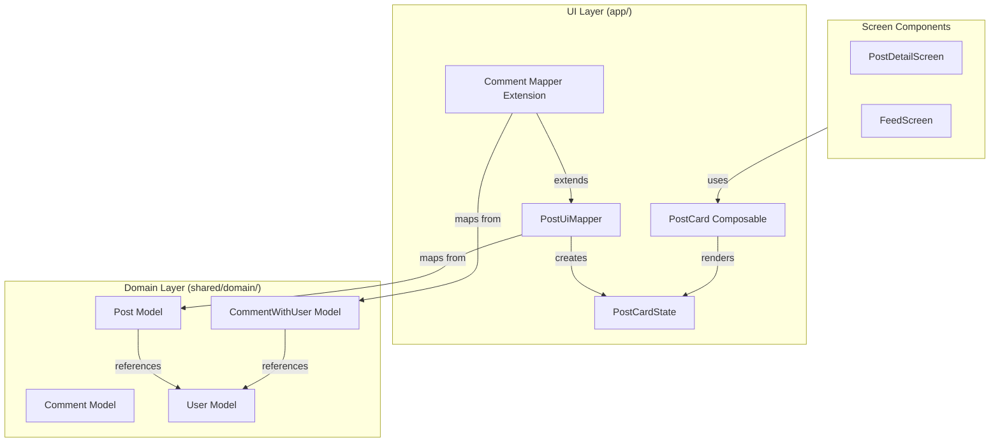

# Design Document: Comment Post Card Reuse

## Overview

This design consolidates comment UI rendering by extending the existing PostCard component to handle both posts and comments. Currently, the codebase has three separate components for rendering content: PostCard for posts, CommentItem for post detail comments, and FeedCommentItem for feed comments. This duplication leads to maintenance overhead and inconsistent behavior.

The solution extends PostCardState with optional comment-specific fields, creates a mapper from CommentWithUser to PostCardState, and adapts PostCard's rendering logic to conditionally display comment-specific features (reply context, thread lines, smaller avatars) while hiding post-specific features (repost button, media attachments, polls).

### Key Benefits

- Single source of truth for content rendering logic
- Consistent UI/UX across posts and comments
- Reduced code duplication (~400 lines eliminated)
- Easier maintenance and feature additions
- Preserved Clean Architecture boundaries

### Design Principles

- Backward compatibility: Existing PostCard usage remains unchanged
- Composition over inheritance: Use optional fields rather than subclassing
- Clean Architecture: UI mappers in app layer, domain models unchanged
- Material Design: Use MaterialTheme and Spacing tokens throughout

## Architecture

### Layer Organization

Following Clean Architecture principles, the implementation spans three layers:



### Component Responsibilities

**PostCardState** (UI Layer)
- Holds all data needed to render a post or comment
- Includes optional comment-specific fields
- Remains @Stable for Compose optimization

**PostCard** (UI Layer)
- Renders both posts and comments based on state
- Conditionally shows/hides features based on content type
- Handles user interactions via callbacks

**PostUiMapper** (UI Layer)
- Transforms domain models to UI state
- Existing: Post → PostCardState
- New: CommentWithUser → PostCardState

**CommentItem/FeedCommentItem** (UI Layer - To Be Removed)
- Deprecated after migration
- Functionality absorbed by PostCard

## Components and Interfaces

### PostCardState Extension

The existing PostCardState will be extended with optional comment-specific fields:

```kotlin
@Stable
data class PostCardState(
    // Existing fields (unchanged)
    val post: Post,
    val user: User,
    val isLiked: Boolean,
    val likeCount: Int,
    val commentCount: Int,
    val repostCount: Int = 0,
    val viewsCount: Int = 0,
    val isBookmarked: Boolean,
    val hideLikeCount: Boolean = false,
    val mediaUrls: List<String> = emptyList(),
    val isVideo: Boolean = false,
    val pollQuestion: String? = null,
    val pollOptions: List<PollOption>? = null,
    val userPollVote: Int? = null,
    val formattedTimestamp: String = "",
    val isExpanded: Boolean = false,
    val repostedBy: String? = null,
    
    // New comment-specific fields
    val isComment: Boolean = false,
    val parentCommentId: String? = null,
    val parentAuthorUsername: String? = null,
    val repliesCount: Int = 0,
    val depth: Int = 0,
    val showThreadLine: Boolean = false,
    val isLastReply: Boolean = false
)
```

**Design Rationale:**
- Optional fields with defaults maintain backward compatibility
- `isComment` flag enables conditional rendering logic
- `depth` supports nested comment visualization
- `showThreadLine` and `isLastReply` control thread line rendering
- All existing PostCard usages continue working without changes

### Comment Mapper Extension

A new mapper function extends PostUiMapper to handle CommentWithUser:

```kotlin
object PostUiMapper {
    // Existing function (unchanged)
    fun toPostCardState(
        post: Post, 
        currentProfile: UserProfile? = null, 
        isExpanded: Boolean = false
    ): PostCardState { /* ... */ }
    
    // New function for comments
    fun toPostCardState(
        comment: CommentWithUser,
        parentAuthorUsername: String? = null,
        depth: Int = 0,
        showThreadLine: Boolean = false,
        isLastReply: Boolean = false
    ): PostCardState {
        val user = User(
            uid = comment.userId,
            username = comment.getUsername(),
            avatar = comment.getAvatarUrl(),
            verify = comment.user?.isVerified ?: false
        )
        
        // Create a minimal Post object for comment content
        val post = Post(
            id = comment.id,
            authorUid = comment.userId,
            postText = comment.content,
            timestamp = parseTimestamp(comment.createdAt),
            likesCount = comment.likesCount,
            commentsCount = comment.repliesCount
        )
        
        return PostCardState(
            post = post,
            user = user,
            isLiked = comment.userReaction != null,
            likeCount = comment.getTotalReactions(),
            commentCount = comment.repliesCount,
            repostCount = 0,
            viewsCount = 0,
            isBookmarked = false,
            hideLikeCount = false,
            mediaUrls = emptyList(),
            isVideo = false,
            pollQuestion = null,
            pollOptions = null,
            userPollVote = null,
            formattedTimestamp = TimeUtils.getTimeAgo(comment.createdAt),
            isExpanded = false,
            repostedBy = null,
            // Comment-specific fields
            isComment = true,
            parentCommentId = comment.parentCommentId,
            parentAuthorUsername = parentAuthorUsername,
            repliesCount = comment.repliesCount,
            depth = depth,
            showThreadLine = showThreadLine,
            isLastReply = isLastReply
        )
    }
}
```

**Design Rationale:**
- Overloaded function maintains clean API
- Creates minimal Post object to satisfy PostCardState requirements
- Maps comment metrics to corresponding post fields
- Handles null user data gracefully with CommentWithUser helper methods
- Depth and thread visualization parameters passed from parent

### PostCard Rendering Adaptations

PostCard will be modified to conditionally render based on `state.isComment`:

**Avatar Sizing:**
```kotlin
val avatarSize = when {
    state.isComment && state.depth > 0 -> 32.dp
    state.isComment -> 40.dp
    else -> 48.dp
}
```

**Reply Context Display:**
```kotlin
if (state.isComment && state.parentAuthorUsername != null) {
    Row(
        modifier = Modifier.padding(bottom = Spacing.ExtraSmall),
        verticalAlignment = Alignment.CenterVertically
    ) {
        Text(
            text = stringResource(R.string.replying_to),
            style = MaterialTheme.typography.bodyMedium,
            color = MaterialTheme.colorScheme.onSurfaceVariant
        )
        Text(
            text = " @${state.parentAuthorUsername}",
            style = MaterialTheme.typography.bodyMedium,
            color = MaterialTheme.colorScheme.primary,
            modifier = Modifier.clickable { /* Navigate to parent */ }
        )
    }
}
```

**Thread Line Rendering:**
```kotlin
if (state.isComment && state.showThreadLine) {
    Box(
        modifier = Modifier
            .width(Spacing.Tiny)
            .fillMaxHeight()
            .background(
                MaterialTheme.colorScheme.outlineVariant.copy(alpha = 0.4f)
            )
    )
}
```

**Feature Hiding:**
```kotlin
// Hide repost button for comments
if (!state.isComment) {
    IconButton(onClick = onRepostClick) {
        Icon(Icons.Outlined.Repeat, contentDescription = "Repost")
    }
}

// Hide media, polls, quoted posts for comments
if (!state.isComment) {
    PostContent(
        mediaUrls = state.mediaUrls,
        pollQuestion = state.pollQuestion,
        quotedPost = state.post.quotedPost,
        // ...
    )
} else {
    // Only render text content for comments
    MarkdownText(text = state.post.postText ?: "")
}
```

### Interaction Callbacks

PostCard already has appropriate callbacks that work for comments:

- `onCommentClick` → triggers reply action for comments
- `onLikeClick` → handles comment likes
- `onShareClick` → handles comment sharing
- `onUserClick` → navigates to user profile
- `onReactionSelected` → displays reaction picker on long press

No changes needed to callback signatures.

## Data Models

### Domain Models (Unchanged)

The domain layer models remain unchanged, preserving Clean Architecture:

**CommentWithUser** (shared/domain/)
```kotlin
@Serializable
data class CommentWithUser(
    val id: String,
    val postId: String,
    val userId: String,
    val parentCommentId: String? = null,
    val content: String,
    val createdAt: String,
    val likesCount: Int = 0,
    val repliesCount: Int = 0,
    val user: UserProfile? = null,
    val userReaction: ReactionType? = null,
    val reactionSummary: Map<ReactionType, Int> = emptyMap()
)
```

**Post** (app/domain/)
```kotlin
@Serializable
data class Post(
    val id: String,
    val authorUid: String,
    val postText: String?,
    val timestamp: Long,
    val likesCount: Int,
    val commentsCount: Int,
    // ... many other fields
)
```

### UI State Model (Modified)

**PostCardState** - See "PostCardState Extension" section above for complete definition.

### FeedItem.CommentItem (Unchanged)

The existing FeedItem.CommentItem domain model remains unchanged:

```kotlin
data class CommentItem(
    override val id: String,
    override val timestamp: Long,
    val userId: String,
    val username: String,
    val userFullName: String,
    val avatarUrl: String?,
    val isVerified: Boolean,
    val content: String,
    val createdAt: String?,
    val likeCount: Int,
    val commentCount: Int,
    val isLiked: Boolean,
    val parentPostId: String?,
    val parentAuthorUsername: String?
) : FeedItem
```

A separate mapper will convert FeedItem.CommentItem to PostCardState.


## Correctness Properties

*A property is a characteristic or behavior that should hold true across all valid executions of a system—essentially, a formal statement about what the system should do. Properties serve as the bridge between human-readable specifications and machine-verifiable correctness guarantees.*

### Property 1: Backward Compatibility for Post Mapping

*For any* Post object, mapping it to PostCardState using the existing toPostCardState function should produce a state where isComment is false and all post-specific fields are correctly populated.

**Validates: Requirements 1.2**

### Property 2: Comment Discriminator Flag

*For any* CommentWithUser object, mapping it to PostCardState should produce a state where isComment is true.

**Validates: Requirements 1.3**

### Property 3: Depth Preservation

*For any* CommentWithUser object and depth value, mapping the comment with that depth should produce a PostCardState where the depth field equals the input depth value.

**Validates: Requirements 1.4**

### Property 4: Comprehensive Comment Mapping

*For any* CommentWithUser object, mapping it to PostCardState should preserve all essential data: user information (username, avatar, verified status), content (mapped to post.postText), and metrics (likesCount mapped to likeCount, repliesCount mapped to commentCount).

**Validates: Requirements 2.2, 2.3, 2.4**

### Property 5: Post Features Hidden for Comments

*For any* PostCardState where isComment is true, rendering the PostCard should not display post-specific features: repost button, media attachments, polls, or quoted posts.

**Validates: Requirements 3.4**

### Property 6: Avatar Sizing by Depth

*For any* PostCardState where isComment is true, the avatar size should be 32.dp when depth > 0, and 40.dp when depth == 0.

**Validates: Requirements 3.5**

### Property 7: Reply Context Display Logic

*For any* PostCardState where isComment is true, the reply context ("Replying to @username") should be displayed if and only if parentAuthorUsername is not null.

**Validates: Requirements 4.1, 4.4**

### Property 8: Thread Line Display Logic

*For any* PostCardState where isComment is true, the thread line should be displayed if and only if showThreadLine is true and isLastReply is false.

**Validates: Requirements 5.1, 5.4**

### Property 9: FeedItem Comment Mapping

*For any* FeedItem.CommentItem object, mapping it to PostCardState should produce a valid state with isComment true, content mapped correctly, and parent context preserved if present.

**Validates: Requirements 7.3**

### Property 10: Depth Limiting

*For any* comment tree, the maximum depth of nested comments should not exceed a reasonable limit (e.g., 10 levels) to prevent performance degradation.

**Validates: Requirements 10.3**

## Error Handling

### Null User Data

**Scenario:** CommentWithUser has null user field

**Handling:**
- Use CommentWithUser helper methods (getUsername(), getAvatarUrl(), getDisplayName())
- These methods provide safe defaults: "Unknown User", "unknown", null avatar
- Mapper creates User object with these defaults
- UI renders gracefully without crashes

**Code Pattern:**
```kotlin
val user = User(
    uid = comment.userId,
    username = comment.getUsername(), // Returns "unknown" if null
    avatar = comment.getAvatarUrl(),  // Returns null if user is null
    verify = comment.user?.isVerified ?: false
)
```

### Missing Timestamp

**Scenario:** Comment createdAt is empty or invalid

**Handling:**
- TimeUtils.getTimeAgo() handles empty strings gracefully
- Returns "now" as fallback
- No crash, degraded but functional display

### Invalid Depth Values

**Scenario:** Depth parameter is negative or exceeds maximum

**Handling:**
- Clamp depth to valid range: max(0, min(depth, MAX_DEPTH))
- MAX_DEPTH constant defined (e.g., 10)
- Prevents layout issues and performance problems

**Code Pattern:**
```kotlin
private const val MAX_COMMENT_DEPTH = 10

fun toPostCardState(
    comment: CommentWithUser,
    depth: Int = 0,
    // ...
): PostCardState {
    val clampedDepth = depth.coerceIn(0, MAX_COMMENT_DEPTH)
    // ...
}
```

### Empty Content

**Scenario:** Comment content is empty or whitespace-only

**Handling:**
- Markdown renderer handles empty strings
- UI displays empty comment with user info and actions
- No crash, allows deletion/moderation actions

### Callback Null Safety

**Scenario:** Optional callbacks (onReactionSelected) are null

**Handling:**
- PostCard already handles optional callbacks with null checks
- Long-press reaction only enabled when callback provided
- No changes needed, existing pattern works for comments

### Migration Edge Cases

**Scenario:** During migration, both old and new components might be used

**Handling:**
- Feature flag or gradual rollout approach
- Old components remain functional until fully replaced
- No breaking changes to existing screens during transition
- Delete old files only after complete migration and testing

## Testing Strategy

### Dual Testing Approach

This feature requires both unit tests and property-based tests for comprehensive coverage:

**Unit Tests** focus on:
- Specific examples of comment mapping
- Edge cases (null user, empty content, max depth)
- UI callback triggering for specific interactions
- Integration between PostCard and screen components
- Migration verification (old functionality preserved)

**Property-Based Tests** focus on:
- Universal properties across all inputs
- Comprehensive input coverage through randomization
- Invariants that must hold for any valid comment/post

### Property-Based Testing Configuration

**Library:** Use Kotest Property Testing for Kotlin
- Minimum 100 iterations per property test
- Each test references its design document property
- Tag format: `Feature: comment-post-card-reuse, Property {number}: {property_text}`

**Example Test Structure:**
```kotlin
class CommentMappingPropertyTest : StringSpec({
    "Feature: comment-post-card-reuse, Property 2: Comment Discriminator Flag" {
        checkAll(100, Arb.commentWithUser()) { comment ->
            val state = PostUiMapper.toPostCardState(comment)
            state.isComment shouldBe true
        }
    }
    
    "Feature: comment-post-card-reuse, Property 4: Comprehensive Comment Mapping" {
        checkAll(100, Arb.commentWithUser()) { comment ->
            val state = PostUiMapper.toPostCardState(comment)
            
            // User info preserved
            state.user.username shouldBe comment.getUsername()
            state.user.avatar shouldBe comment.getAvatarUrl()
            
            // Content preserved
            state.post.postText shouldBe comment.content
            
            // Metrics preserved
            state.likeCount shouldBe comment.getTotalReactions()
            state.commentCount shouldBe comment.repliesCount
        }
    }
})
```

### Unit Test Coverage

**Mapper Tests:**
- Post to PostCardState (existing, verify no regression)
- CommentWithUser to PostCardState (new)
- FeedItem.CommentItem to PostCardState (new)
- Null user data handling
- Empty content handling
- Depth clamping

**UI Component Tests:**
- PostCard renders posts correctly (existing, verify no regression)
- PostCard renders comments with correct avatar size
- PostCard hides post features for comments
- PostCard shows reply context when appropriate
- PostCard renders thread lines correctly
- Interaction callbacks triggered correctly

**Integration Tests:**
- PostDetailScreen displays comments using PostCard
- FeedScreen displays comments using PostCard
- Thread visualization matches old behavior
- Navigation from comments works correctly

### Test Data Generators

**Arbitrary Generators for Property Tests:**
```kotlin
fun Arb.Companion.commentWithUser(): Arb<CommentWithUser> = arbitrary {
    CommentWithUser(
        id = Arb.uuid().bind(),
        postId = Arb.uuid().bind(),
        userId = Arb.uuid().bind(),
        parentCommentId = Arb.orNull(Arb.uuid()).bind(),
        content = Arb.string(1..500).bind(),
        createdAt = Arb.instant().bind().toString(),
        likesCount = Arb.int(0..10000).bind(),
        repliesCount = Arb.int(0..100).bind(),
        user = Arb.orNull(Arb.userProfile()).bind(),
        userReaction = Arb.orNull(Arb.reactionType()).bind()
    )
}

fun Arb.Companion.userProfile(): Arb<UserProfile> = arbitrary {
    UserProfile(
        id = Arb.uuid().bind(),
        username = Arb.string(3..20).bind(),
        displayName = Arb.string(1..50).bind(),
        avatar = Arb.orNull(Arb.string()).bind(),
        isVerified = Arb.bool().bind()
    )
}
```

### Migration Verification Tests

**Before Migration:**
- Capture screenshots of comment rendering in PostDetailScreen
- Capture screenshots of comment rendering in FeedScreen
- Record all interaction behaviors (reply, like, share, navigate)

**After Migration:**
- Visual regression tests comparing screenshots
- Interaction tests verify same callbacks triggered
- Performance tests verify no degradation
- Existing test suite passes without modification

### Performance Testing

**Metrics to Monitor:**
- Recomposition count when scrolling comment lists
- Memory usage with deeply nested comment threads
- Frame rate during comment list scrolling
- Time to render 100 comments

**Acceptance Criteria:**
- No more than 10% performance degradation vs. old components
- Smooth 60fps scrolling on mid-range devices
- Memory usage stable with nested comments

### Manual Testing Checklist

- [ ] Posts render correctly (no regression)
- [ ] Top-level comments display with 40.dp avatar
- [ ] Nested comments display with 32.dp avatar
- [ ] Reply context shows for replies
- [ ] Reply context hidden for top-level comments
- [ ] Thread lines display for comments with replies
- [ ] Thread lines hidden for last replies
- [ ] Like button works and shows correct state
- [ ] Reply button triggers comment action
- [ ] Share button works
- [ ] Long-press like shows reaction picker
- [ ] User avatar/name navigation works
- [ ] Markdown content renders correctly
- [ ] Feed comments display correctly
- [ ] Post-specific features hidden for comments (repost, media, polls)
- [ ] Theme colors applied correctly (no hardcoded colors)
- [ ] Spacing tokens used (no hardcoded dimensions)
- [ ] String resources used (no hardcoded text)

