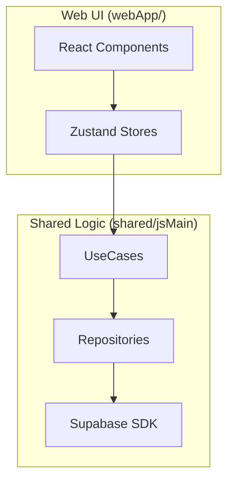

# Product Requirements Document (PRD): Synapse Social Web

## 1. Product Brief
**Synapse Social Web** is the desktop/browser extension of the Synapse Social ecosystem. It aims to provide a seamless, high-performance social networking experience on the web, complementing the existing native Android and iOS applications while leveraging the shared Kotlin Multiplatform (KMP) engine.

---

## 2. Goals & Objectives
- **Omni-platform Presence**: Enable users to access their feeds, chats, and profiles from any browser.
- **Code Reuse**: Maximize reuse of the `shared` module (Domain & Data layers) from the KMP project.
- **Rich Aesthetics**: Deliver a premium, "next-gen" UI with smooth animations, glassmorphism, and high responsiveness.
- **Real-time Synchronization**: Ensure real-time messaging and notifications across all platforms using Supabase Realtime.

---

## 3. Technology Stack (Web)
| Component | Technology | Rationale |
| :--- | :--- | :--- |
| **Framework** | **Vite + React (TypeScript)** | Industry standard for high-speed development and rich UI control. |
| **Logic Layer** | **Kotlin Multiplatform (JS Target)** | Direct reuse of `shared` Ktor, Supabase, and Domain Logic. |
| **Styling** | **Vanilla CSS + Glassmorphism** | Ultimate flexibility for "Premium" design as per project standards. |
| **Backend** | **Supabase** | Shared with Mobile (Auth, Database, Storage, Realtime). |
| **State Management** | **Zustand / Redux + StateFlow** | Bridging Kotlin Flow to React State. |

---

## 4. Feature Set

### 4.1 Core Features (P0)
- **Unified Authentication**: Login/Register via Email/Password or OAuth (Supabase Auth).
- **Home Feed**: Infinite scrolling feed of posts (Text, Images, Polls) with like/comment interactions.
- **Real-time Chat**: Direct messaging with media support, powered by Supabase Realtime.
- **User Profiles**: Manage personal info, view user posts, and follow/unfollow functionality.
- **Notifications**: In-app notifications for likes, follows, and new messages.

### 4.2 Web-Specific Enhancements (P1)
- **Responsive Layout**: Optimized for both Ultra-wide monitors and standard laptops.
- **Markdown/LaTeX Rendering**: Native support for rich text in posts as highlighted in the KMP README.
- **Drag-and-Drop Uploads**: Enhanced media uploading for desktop users.
- **Split-Pane Design**: Simultaneous view of Chat list and active Conversation.

### 4.3 Advanced Features (P2)
- **AI Sidebar**: Gemini-powered AI tools for post generation and summarization (matching mobile features).
- **Desktop Notifications**: System-level push notifications via Service Workers.
- **Offline Cache**: Basic offline support for reading cached posts (SQLDelight/IndexedDB).

---

## 5. UI/UX Principles (Dynamic Design)
Following the "Rich Aesthetics" mandate:
- **Color Palette**: Dark mode by default (Deep Space grey, Vibrant Indigo accents). Use `MaterialTheme.colorScheme` tokens.
- **Motion**: Every interactive element must have hover micro-animations. Page transitions should be fluid.
- **Transparency**: Extensive use of background blurs and glassmorphism.
- **Typography**: Modern, clean sans-serif (e.g., Inter or Outfit).

---

## 6. Architecture & Integration
The Web App will follow the **Clean Architecture** patterns defined in `AGENTS.md`.

---

## 7. Roadmap
1. **Phase 1 (Foundation)**: Setup Vite environment, Configure KMP JS Target, Implement Auth.
2. **Phase 2 (Content)**: Feed implementation, Post Detail views, and Profile management.
3. **Phase 3 (Engagement)**: Real-time Messaging and Notifications.
4. **Phase 4 (Polishing)**: AI integration and Glassmorphic UI finalization.

---
*Created by Antigravity AI - Part of the Synapse Social Team.*
